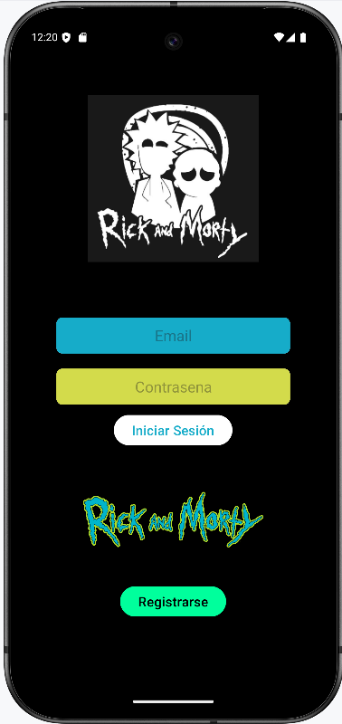
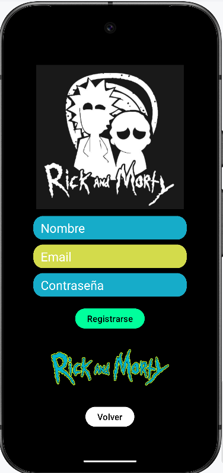
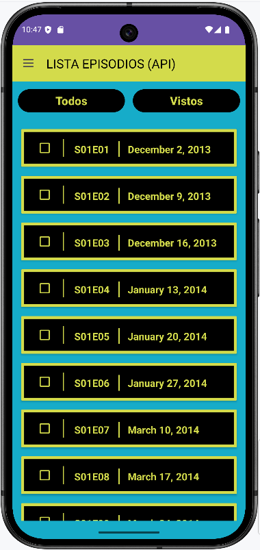
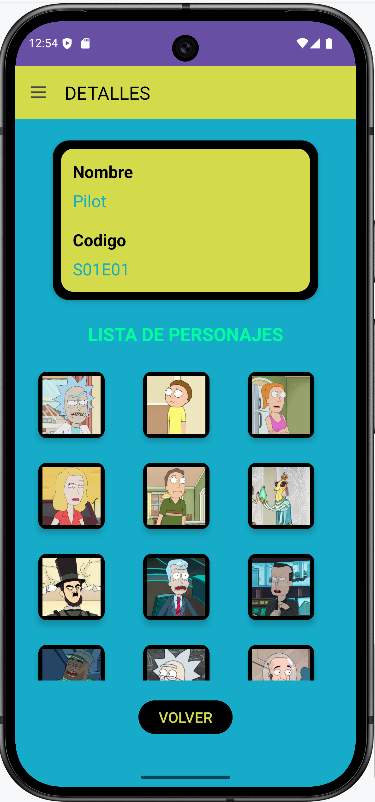
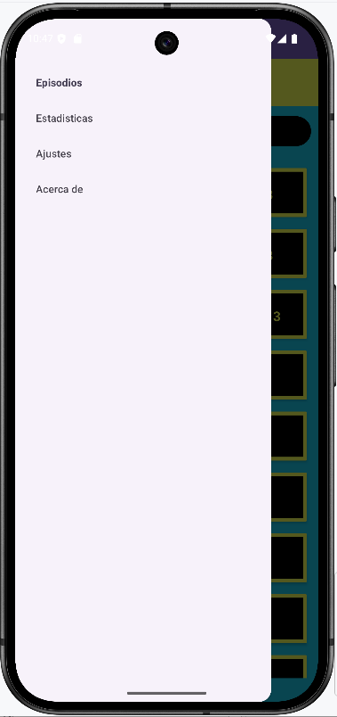
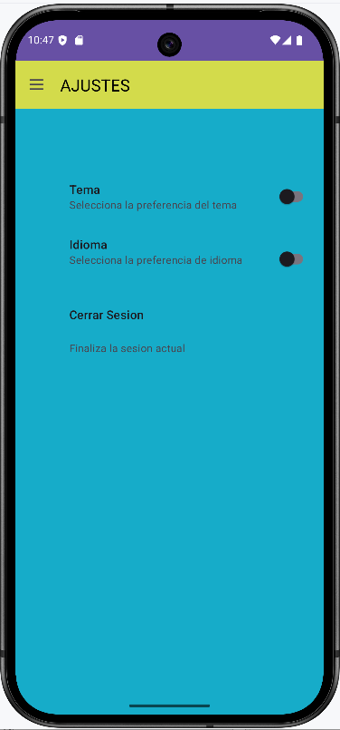
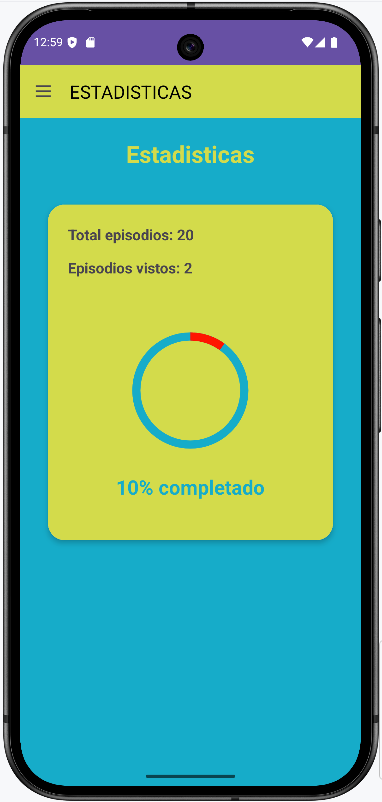
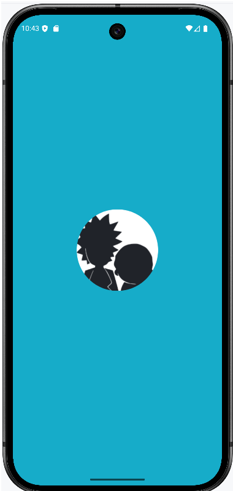

# 🚀 Rick and Morty Episode Tracker

Aplicación Android que permite visualizar y gestionar los episodios de Rick and Morty,
con autenticación de usuarios, almacenamiento en la nube y estadísticas de visualización.
> Desarrollada en Kotlin como proyecto de portafolio.  
> Implementa consumo de API REST, autenticación Firebase y gestión de episodios vistos.

---

## 📱 Capturas de pantalla

### Tema Claro

|      Pantalla Login      |       Pantalla Registro     |        Lista Episodios         |  Detalle Episodio    | 
|:------------------------:|:--:|:------------------------------:|:---:
|  |   |  |   | 

|       Menú Lateral        |           Ajustes            |           Statics.           |             Splash.             |
|:-------------------------:|:----------------------------:|:----------------------------:|:-------------------------------:|
|  |  |  |  |

---

## 🎬 Demostración en video

<video src="Images/app.mp4" autoplay loop muted playsinline width="100%"></video>

*Demostración del funcionamiento de la aplicación*

📹 [Descargar video](Images/app.mp4) *(si no se reproduce)*

---

## ✨ Características principales

### 🔐 Autenticación
- Registro de nuevos usuarios con email y contraseña
- Inicio de sesión seguro con Firebase Authentication
- Cierre de sesión desde el menú de ajustes

### 📺 Gestión de episodios
- Lista completa de episodios desde la **API de Rick and Morty**
- **RecyclerView** con diseño optimizado
- Filtro para mostrar **solo episodios vistos**
- Vista detallada con **personajes del episodio** en grid

### 📊 Estadísticas
- Contador de episodios vistos vs totales
- Porcentaje de progreso visual
- Gráfico circular interactivo

### ⚙️ Ajustes
- Cambio de idioma: **Español / Inglés**
- **Modo oscuro / claro** con persistencia en SharedPreferences
- Cierre de sesión

---

## 🛠️ Tecnologías utilizadas

- **Kotlin** - Lenguaje de programación
- **Android SDK** - Desarrollo de la app (API 24 - 36)
- **Material Design 3** - Componentes y estilos
- **ViewBinding** - Acceso seguro a vistas
- **RecyclerView** - Listado de episodios y personajes
- **Retrofit** - Consumo de la API de Rick and Morty
- **Firebase Authentication** - Registro e inicio de sesión
- **Firestore** - Base de datos en la nube
- **SharedPreferences** - Persistencia de ajustes (idioma, tema)
- **Coil** - Carga de imágenes de personajes
- **Corrutinas** - Operaciones asíncronas

---

## 📚 Sobre el proyecto

Este proyecto fue desarrollado como parte de mi formación en desarrollo Android.  
Demuestra mis habilidades en:

- **Consumo de APIs**: Uso de **Retrofit** para consumir la API de Rick and Morty
- **Autenticación**: Implementación de **Firebase Authentication** con email/contraseña
- **Persistencia en la nube**: Uso de **Firestore** para guardar datos de usuario
- **Almacenamiento local**: **SharedPreferences** para preferencias de idioma y tema
- **Arquitectura**: Organización en capas siguiendo principios **MVVM**
- **UX/UI**: Material Design, temas claro/oscuro y soporte multidioma

---

## 🚀 Instalación

1. Clona el repositorio
2. Abre el proyecto en Android Studio
3. Sincroniza Gradle y ejecuta la app

---

## 👨‍💻 Autor

**Abraham C**  
[GitHub](https://github.com/acdezindev) | [LinkedIn](https://www.linkedin.com/in/AbrahamCdev)

